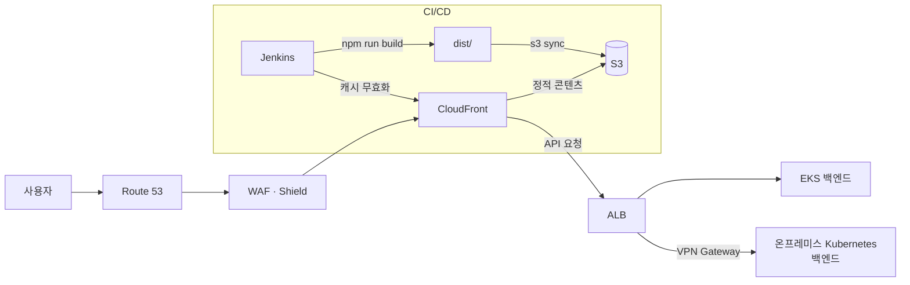

# 🌱 콩콩팥팥

> **농업 데이터로 신용을 만들고, 수확으로 갚는 농민 BNPL 서비스**
>
> 내 농사 기록이 신용이 됩니다. 복잡한 서류 없이 스마트폰으로 3분 만에 한도 신청을 끝내고,
> 씨앗·비료·농약 등 필요한 농자재를 신용으로 먼저 구매한 뒤 수확 후 여유롭게 상환하세요.

<br/>


<br/>

## 📱 주요 기능

### 🏠 메인 · 한도 신청하기

<table>
<tr>
<td width="30%" valign="top">
  
</td>
<td valign="top">

로그인 후 만나는 홈 화면에서 내 **신용 한도 현황**(신청 전 / 심사 중 / 승인 완료 / 거절),
**사용 가능 잔액**, **추천 농자재**, **배송 현황**을 확인할 수 있습니다.

 '외상 한도 확인하기' 버튼 클릭 시 바로 **한도 신청**으로 진입하며, 농업 데이터 기반 신용 심사가 단계별로 진행됩니다.

<br/>

**안내 → 농지 정보 → 재배 작물 → 보험 가입 여부 → 서류 첨부 → 신청 완료**

- 각 단계 입력값은 세션 단위로 서버에 저장되어, 중간에 실패해도 이어서 진행할 수 있습니다.
- 재배 작물·보험 여부에 따라 필요 서류가 동적으로 결정됩니다. (농업경영체 등록 확인서, 농작물재해보험 가입 증명서 등)
- 세션 만료 등 예외 상황도 안내 메시지로 처리합니다.
</td>
</tr>
</table>
<br/>

### 🛒 상점 · 결제

<table>
<tr>
<td width="30%" valign="top">
  
</td>
<td valign="top">

씨앗, 비료, 농약 등 농자재를 둘러보고 승인받은 **신용 한도로 결제하는 BNPL** 플로우입니다.

🛒 상점
- **카테고리 필터 · 상품 검색**으로 원하는 농자재를 빠르게 찾을 수 있습니다.
- 상품 상세에서 수량을 선택해 **장바구니 담기** 또는 **바로 구매**가 가능하며, 장바구니 상태는 서버와 동기화됩니다.

💳 결제
- 결제 화면에서 배송지·주문 상품·**남은 한도**를 확인한 뒤 결제를 진행합니다.
- **결제 PIN 6자리**로 본인 인증 후 결제가 완료됩니다.
  - PIN 미등록 사용자는 **PIN 등록 화면**으로 안내됩니다.
- 결제 내역과 상환 현황은 **내 지갑** 또는 **이용 내역** 화면에서 확인합니다.

</td>
</tr>
</table>
<br/>


### 🤖 챗봇

<table>
<tr>
<td width="30%" valign="top">
  
</td>
<td valign="top">

**농민 전용 AI 챗봇**입니다. AI 챗봇과의 대화만으로도 맞춤형 상품 추천, 주문, 결제까지 서비스의 주요 기능을 실행할 수 있습니다.

- 자연어 질문에 답변과 함께 UI 카드로 응답합니다.
  - 💰 **한도 요약** (총 한도 / 사용액 / 잔여 한도)
  - 📅 **상환 요약** (다음 납부일, 이자, 연체 여부)
  - 🚚 **배송 상태 조회**
  - 🌾 **상품 추천**
  - ✅ **결제 확인** (챗봇 안에서 결제 의사 확인까지)
- 카드의 액션 버튼으로 관련 화면(한도 신청, 상점 등)으로 바로 이동합니다.
- 세션 기반으로 대화 이력이 유지되며, 세션 복구 실패 시 자동으로 새 세션을 시작합니다.
</td>
</tr>
</table>
<br/>


## 🛠 기술 스택

| 분류 | 기술 | 사용 이유 |
| --- | --- | --- |
| Language | TypeScript | API 응답·도메인 모델(신용 상태, 챗봇 카드 등)을 타입으로 정의해 금융 서비스에서 중요한 데이터 정합성을 컴파일 타임에 보장 |
| Framework | React 19 | 한도 신청·회원가입 같은 다단계 플로우를 상태 기반 컴포넌트로 단순하게 구성, 최신 버전으로 성능 개선 활용 |
| Build | Vite 8 | 빠른 개발 서버(HMR)와 빌드 속도, `import.meta.env` 기반의 간편한 환경 변수 관리 |
| Routing | React Router 7 | 중첩 라우트로 `PrivateRoute`(인증 보호)를 선언적으로 적용, `location.state`로 결제 페이지에 주문 정보 전달 |
| Server State | TanStack Query 5 | 신용 한도·이용 내역 등 서버 데이터의 캐싱/로딩/에러 상태를 자동 관리, 한도 신청 단계별 mutation 흐름을 훅으로 캡슐화 |
| Client State | Zustand 5 | 장바구니처럼 여러 화면이 공유하는 클라이언트 상태를 보일러플레이트 없이 가볍게 관리 (Redux 대비 코드량 최소화) |
| HTTP | Axios | 마이크로서비스별(BFF 없이 auth/core/shop/aiops 직접 호출) 클라이언트 인스턴스 분리, 인터셉터로 JWT 첨부·토큰 갱신·에러 처리 공통화 |
| Styling | Tailwind CSS 4 | 유틸리티 클래스로 모바일 우선(390px) 레이아웃을 빠르게 구현, 별도 CSS 파일 관리 부담 최소화 |
| Icons | lucide-react | 트리 셰이킹을 지원하는 경량 아이콘 세트로 일관된 UI 아이콘 제공 |
| CI/CD | Jenkins | Jenkinsfile 기반 파이프라인으로 빌드·배포 자동화 |

<br>

## 📂 프로젝트 구조

```
src/
├── api/          # 서비스별 axios 클라이언트 (auth / core / shop / cart / aiops)
│                 # 토큰 저장소, 인터셉터, 도메인별 API 함수
├── components/   # 공통 컴포넌트 (BottomNav, Button, CreditLimitCard 등)
│   ├── ass/      # 한도 신청 단계별 컴포넌트
│   ├── shop/     # 상점·결제 컴포넌트
│   └── signup/   # 회원가입 단계별 컴포넌트
├── hooks/        # React Query 기반 커스텀 훅
├── pages/        # 라우트 단위 페이지
├── stores/       # Zustand 스토어
├── styles/       # 컬러 팔레트 등 공통 스타일
├── types/        # 도메인 타입 정의
└── utils/        # 유틸 함수
```

모바일 우선(최대 390px) 레이아웃으로, 데스크톱에서도 모바일 앱처럼 중앙 정렬되어 표시됩니다.
로그인이 필요한 화면은 `PrivateRoute`로 보호됩니다.

<br>

## 🏗 배포 아키텍처



- 온프레미스 **Jenkins**가 빌드 결과물(`dist/`)을 **S3**에 배포하고 **CloudFront 캐시를 무효화**
- 정적 콘텐츠는 **CloudFront + S3**로 서빙
- API 요청은 ALB에서 서비스에 따라 분기
  - 일부는 **AWS EKS**의 백엔드로, 일부는 **VPN 게이트웨이를 거쳐 온프레미스 Kubernetes 클러스터**의 백엔드로 전달되는 하이브리드 구성

<br>

### ⚙️ 환경 변수

백엔드가 마이크로서비스로 분리되어 있어 서비스별 API 주소를 설정합니다.
(개발 모드에서는 미설정 시 localhost 기본값 사용)

| 변수 | 설명 | 개발 기본값 |
| --- | --- | --- |
| `VITE_API_AUTH_URL` | 인증 서비스 | `http://localhost:8091` |
| `VITE_API_CORE_URL` | 코어(신용/지갑) 서비스 | `http://localhost:8090` |
| `VITE_API_SHOP_URL` | 상점 서비스 | `http://localhost:8081` |
| `VITE_API_CART_URL` | 장바구니 서비스 | `http://localhost:8081` |
| `VITE_API_AIOPS_URL` | AI(챗봇) 서비스 | `http://localhost:8000` |

---
## 🔗 관련 레포지토리

| 레포 | 설명 |
| --- | --- |
| [`back-end`](https://github.com/FISA-Agri-Pay/back-end) | 금융 핵심 도메인 백엔드 |
| [`front-end-admin`](https://github.com/FISA-Agri-Pay/front-end-admin) | 관리자용 웹 프론트엔드 |
| [`ai-prediction-model`](https://github.com/FISA-Agri-Pay/ai-prediction-model) | 시계열 예측 모델 · 오토스케일링 정책 |
| [`mcp-aiops-backend`](https://github.com/FISA-Agri-Pay/mcp-aiops-backend) | FastMCP 기반 AIOps 백엔드 |
| [`infra`](https://github.com/FISA-Agri-Pay/infra) | Terraform 기반 IaC · 운영 스크립트 |
| [`git-ops`](https://github.com/FISA-Agri-Pay/git-ops) | ArgoCD GitOps 배포 매니페스트 |

